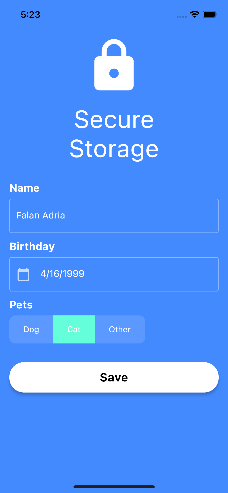

# Flutter Secure Storage

A sample project to demonstrate 'flutter_secure_storage' package.

## Getting Started

### iOS Key Chain Service

- The keychain services API helps you solve this problem by giving your app a mechanism to store small bits of user data in an encrypted database called a keychain.

- The keychain is not limited to passwords. You can store other secrets that the user explicitly cares about, such as credit card information or even short notes. You can also store items that the user needs but may not be aware of. For example, the cryptographic keys and certificates.

### Android KeyStore System

- The Android Keystore system lets you store cryptographic keys in a container to make it more difficult to extract from the device. Once keys are in the keystore, they can be used for cryptographic operations with the key material remaining ‘non-exportable’.

- [Youbute Video](https://www.youtube.com/watch?v=Oqhrxk_f1RE&t=63s)
- [Flutter secure storage package](https://pub.dev/packages/flutter_secure_storage/install)
- [iOS KeyChain Service](https://developer.apple.com/documentation/security/keychain_services#//apple_ref/doc/uid/TP30000897-CH203-TP1)
- [Android KeyStore System](https://developer.android.com/training/articles/keystore.html)

### Screen shots

<table>
    <tr>
        <td>  </td>
    </tr>
</table>
